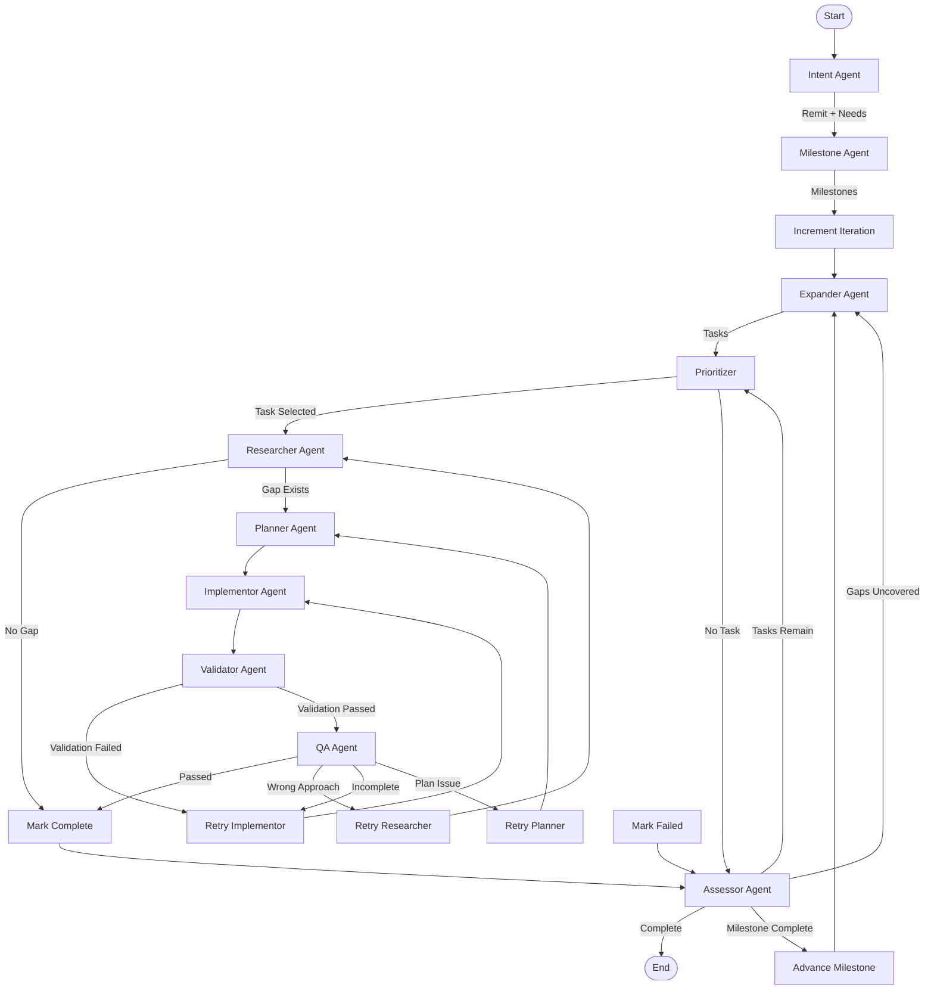
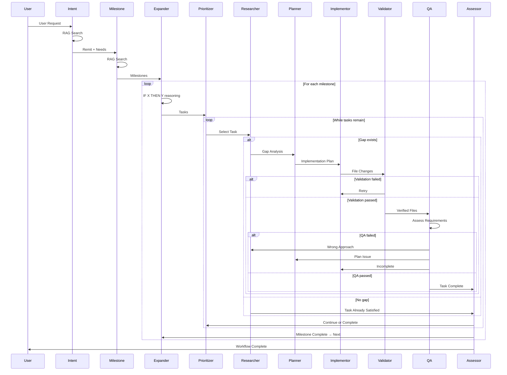

# Iterative Task Tree Workflow Architecture

This document describes the multi-agent workflow for autonomous code development. The system uses a self-iterating task tree model that expands requirements, detects gaps, and implements changes until all tasks within a defined remit are satisfied.

## Design Principles

1. **Milestone-Based Phases**: Work is organized into linear, sequential milestones. Each milestone represents an interim state and contains a bounded task dependency graph. This prevents task overload and ensures the expander benefits from implemented context.

2. **Task Tree over Flat Lists**: Within each milestone, requirements form a DAG (directed acyclic graph) with explicit dependencies, not a flat list processed sequentially.

3. **Progressive Expansion**: The expander only expands milestone N after milestone N-1 is complete. This ensures expansion benefits from already-implemented context and reduces long-term deviation.

4. **Gap-Driven Implementation**: Before implementing, we verify a gap exists between current state and desired state. No gap = task already satisfied.

5. **Typed Contracts**: Each agent has strict input/output schemas. Agents receive only what they need, reducing context bloat.

6. **Context Compression**: With ~40k token limits, all handoffs use compressed summaries rather than full content.

7. **Failure Isolation**: Failed tasks are isolated; the system continues with other branches and surfaces failures for review.

8. **Single Responsibility**: Each agent has one clear responsibility, following cognitive load reduction principles.

---

## High-Level Workflow Architecture



### Workflow Phases

**Phase 1: Intent Understanding** (once at start)
- Intent Agent: Interprets user request, produces remit + explicit/implied needs
- Milestone Agent: Breaks remit into sequential interim states

**Phase 2: Expansion Loop** (iterative)
- Expander Agent: Discovers new tasks via "IF X THEN Y" reasoning for active milestone
- Prioritizer: Selects next ready task
- Execution Loop (Phase 3): Executes single task
- Assessor: Checks for gaps and completion
- Routes back to Expander (if gaps) or Prioritizer (if tasks remain) or END

**Phase 3: Execution Loop** (per task)
- Researcher: Gap analysis
- Route: no gap → mark_complete, gap → Planner
- Planner: Implementation plan
- Implementor: Make changes
- Validator: Verify files exist
- Route: validation failed → Implementor (retry), passed → QA
- QA: Requirement satisfaction check
- Route: passed → mark_complete, failed → route by failure_type

---

## Execution Flow Sequence



---

## Agent Responsibilities

### 1. Intent Agent

**Purpose**: Interpret user request and formulate comprehensive remit (scope boundary).

**When**: Once at workflow start.

| Input | Description |
|-------|-------------|
| `user_request` | Raw user input |
| `repo_root` | Repository root path |

| Output | Description |
|--------|-------------|
| `remit` | Interpreted scope - what the user *really* wants (max 1000 chars) |
| `explicit_needs` | List of explicitly stated needs |
| `implied_needs` | List of inferred necessary needs |
| `confidence` | "high" \| "medium" \| "low" |

**Tools**: `rag_search` (for understanding existing codebase)

**Behavior**:
1. Analyze user request for explicit requirements
2. Identify implied/necessary needs related to the request
3. Use RAG search to understand current codebase state and context
4. Formulate a remit that bounds the scope of work

**Key Constraint**: Focus ONLY on understanding intent, not planning work.

---

### 2. Milestone Agent

**Purpose**: Break remit into sequential milestones representing user-facing interim states.

**When**: Once at workflow start, after Intent.

| Input | Description |
|-------|-------------|
| `remit` | Scope boundary from Intent |
| `explicit_needs` | Explicit needs from Intent |
| `implied_needs` | Implied needs from Intent |
| `repo_root` | Repository root path |

| Output | Description |
|--------|-------------|
| `milestones` | List of Milestone objects (interim states, not tasks) |
| `milestone_order` | Ordered list of milestone IDs |

**Tools**: `rag_search` (for understanding patterns)

**Behavior**:
1. Review the remit and identified needs
2. Identify logical interim states (what users can DO after each)
3. Order milestones by dependency (earlier enables later)
4. Verify each milestone is testable/observable

**Milestone Guidelines**:
- Describe capabilities: "User can X", "System supports Y"
- NOT work descriptions: Avoid "Implement X", use "X is functional"
- Max 200 chars per milestone
- Each milestone should be independently testable
- Think: "What can the user do after this milestone?"

**Key Constraint**: Do not create tasks (that's the Expander's job).

---

### 3. Expander Agent

**Purpose**: Expand a single milestone into tasks through "IF X THEN Y" reasoning.

**When**: After milestone creation (first milestone), and after a milestone is complete (next milestone).

| Input | Description |
|-------|-------------|
| `remit` | Scope boundary |
| `milestone_to_expand` | The milestone being expanded |
| `completed_tasks_from_previous` | Completed tasks from previous milestones (for context) |
| `existing_tasks_in_milestone` | Tasks already in the milestone (pending, ready, in_progress) |
| `uncovered_gaps` | (optional) Uncovered gaps from Assessor within milestone |

| Output | Description |
|--------|-------------|
| `new_tasks` | List of new Task objects for the milestone |
| `tasks_created_this_iteration` | Count of new tasks created |

**Tools**: `rag_search` (for understanding codebase patterns)

**Expansion Patterns** (IF X THEN Y):

1. **Data-driven**: IF action X exists → THEN data model for X must exist
2. **UI-driven**: IF mechanic X exists → THEN UI for X must exist
3. **Integration-driven**: IF feature A and B exist → THEN integration point must exist
4. **Completion-driven**: IF user flow starts at X → THEN it must end at Y
5. **Signal-driven**: IF state changes → THEN something must observe/react
6. **Validation-driven**: IF we accept input X → THEN we need validation for X

**Key Constraint**: Tasks can only depend on other tasks within the same milestone.

**Behavior**:
1. Review completed tasks - what has been done?
2. Review open tasks - what is planned?
3. Apply expansion patterns: "Given X, what else is needed?"
4. Check if identified needs are already covered by open tasks
5. Create new tasks only for uncovered needs
6. Establish dependency edges (within milestone only)

---

### 4. Prioritizer Agent

**Purpose**: Select the next task to execute from the ready pool.

**When**: At start of each execution loop iteration.

| Input | Description |
|-------|-------------|
| `tasks` | Full task tree |
| `active_milestone_id` | Current milestone being worked on |

| Output | Description |
|--------|-------------|
| `current_task_id` | ID of task to execute next (or None if complete) |
| `status` | "running" or "complete" |

**Implementation**: Fully deterministic (no LLM) - uses graph traversal logic.

**Selection Criteria** (in order):
1. Status must be `READY` (all dependencies complete)
2. Prefer tasks with more dependents (unblock more work)
3. Prefer tasks created earlier (stable ordering)
4. Prefer simpler complexity as tie-breaker

**Behavior**:
1. Get all READY tasks in active milestone
2. Sort by priority (blocks count DESC, creation iteration ASC, complexity ASC)
3. Select top task and mark as `IN_PROGRESS`
4. Return task ID or None if no ready tasks

---

### 5. Researcher Agent (Gap Analyzer)

**Purpose**: Assess the gap between current codebase state and what the task requires. **This is a CRITICAL GATE** - if no gap exists, we skip implementation.

**When**: First step when executing a task.

| Input | Description |
|-------|-------------|
| `current_task_id` | ID of task to analyze |
| `tasks` | Full task tree (for dependency context) |
| `repo_root` | Working directory |

| Output | Description |
|--------|-------------|
| `current_gap_analysis` | GapAnalysis object with all fields |
| `tasks` | Updated with gap_analysis stored in task |

**GapAnalysis Structure**:
```python
{
    "task_id": str,
    "gap_exists": bool,  # Critical gate
    "current_state_summary": str,  # max 1000 chars
    "desired_state_summary": str,  # max 1000 chars
    "gap_description": str,        # max 2000 chars
    "relevant_files": list[str],
    "keywords": list[str]
}
```

**Tools**: `rag_search`, `list_directory`, `find_files_by_name`, `search_files`, `read_file_lines`

**Behavior**:
1. Search codebase for existing implementations (RAG + grep + file search)
2. Compare found code against task requirements
3. Determine if gap exists:
   - **No gap**: Task is already satisfied → mark complete, skip implementation
   - **Gap exists**: Describe what's missing
4. Compress findings into structured summary (uses Normaliser with LLM summarization)

**Critical Gate**: If `gap_exists == false`, the workflow skips to task completion.

---

### 6. Planner Agent

**Purpose**: Create a detailed implementation plan for closing the identified gap.

**When**: After Researcher confirms gap exists.

| Input | Description |
|-------|-------------|
| `current_task_id` | ID of task to plan for |
| `tasks` | Full task tree (for dependency context) |
| `current_gap_analysis` | GapAnalysis from Researcher |
| `repo_root` | Working directory |

| Output | Description |
|--------|-------------|
| `current_implementation_plan` | Full markdown plan (PRP format) in ephemeral state |
| `tasks` | Updated with plan_summary stored in task (compressed, max 500 chars) |
| `messages` | Status messages |

**Plan Format (PRP - Pull Request Plan)**:
```markdown
# Implementation Plan: [Task Description]

## Task
- ID: task_001
- Outcome: [measurable outcome]

## Gap Analysis Summary
[From Researcher - what's missing]

## Changes

### Create: `scripts/domain/models/Colony.gd`
**Purpose**: [Why this file]
**Rationale**: [How this closes the gap]

```gdscript
extends Node
class_name Colony
# ... actual code ...
```

### Modify: `scripts/core/GameState.gd`
**Location**: Lines 45-60
**Change**: Add colony tracking
**Rationale**: [Why this change]

```gdscript
# Add after existing variables:
var colonies: Dictionary = {}
```

## Dependencies
- Requires: [other tasks or existing code]
- Enables: [what this unblocks]

## Implementation Notes
- [Important patterns to follow]
- [Edge cases to handle]

## Files Summary
- **Create**: new_file1.gd, new_file2.gd
- **Modify**: existing_file1.gd, existing_file2.gd
```

**Tools**: `rag_search`, `search_files`, `find_files_by_name`, `read_file_lines`

**Behavior**:
1. Understand the gap - What needs to be done?
2. Search for patterns - How do similar things work in the codebase?
3. Identify files to change - What files need creation/modification?
4. Design the changes - What specific code changes are needed?
5. Plan the sequence - What order should changes be made?
6. Write the plan - Create detailed PRP with code snippets

**Key Constraint**: Include CODE SNIPPETS - the Implementor needs to see actual code.

---

### 7. Implementor Agent

**Purpose**: Execute the implementation plan by making actual file changes.

**When**: After Planner produces a plan.

| Input | Description |
|-------|-------------|
| `current_task_id` | ID of task to implement |
| `current_implementation_plan` | Full PRP from Planner |
| `tasks` | Full task tree |
| `repo_root` | Working directory |

| Output | Description |
|--------|-------------|
| `current_implementation_result` | ImplementationResult in ephemeral state |
| `tasks` | Updated with result_summary stored in task (compressed, max 1000 chars) |
| `messages` | Status messages |

**ImplementationResult Structure**:
```python
{
    "task_id": str,
    "files_modified": list[str],      # Files actually changed
    "result_summary": str,            # max 1000 chars
    "issues_noticed": list[str],      # Problems encountered
    "success": bool                   # Did most changes succeed?
}
```

**Tools Available**:
- `read_file`, `read_file_lines` - Inspect existing code
- `write_file`, `create_file` - Create/overwrite files
- `apply_edit` - Surgical edits to existing files
- `glob_search`, `grep_search` - Find files/patterns (via middleware)
- `write_todos` - Track multi-step work (via middleware)

**Behavior**:
1. Read existing files mentioned in plan
2. Execute changes via tools
3. Track what was actually modified
4. Report any issues (files not found, conflicts, etc.)

**Critical Rule**: Must use tools to make changes. Text descriptions are not sufficient.

**Middleware**:
- `TodoListMiddleware`: 5-step work tracking
- `FilesystemFileSearchMiddleware`: glob/grep search
- `SummarizationMiddleware`: Context management (trigger: 30k tokens)

---

### 8. Validator Agent

**Purpose**: Verify that tool calls succeeded and reported changes match reality.

**When**: After Implementor reports completion.

| Input | Description |
|-------|-------------|
| `current_task_id` | ID of task being validated |
| `current_implementation_result` | ImplementationResult from Implementor |
| `repo_root` | Working directory |

| Output | Description |
|--------|-------------|
| `current_validation_result` | ValidationResult in ephemeral state |
| `messages` | Status messages |

**ValidationResult Structure**:
```python
{
    "task_id": str,
    "files_verified": list[str],      # Files that exist and are valid
    "files_missing": list[str],       # Reported files that don't exist
    "validation_passed": bool,        # All files verified?
    "validation_issues": list[str]    # Discrepancies found
}
```

**Behavior** (Deterministic - No LLM):
1. Check each reported file exists on disk
2. Verify file is actually a file (not directory)
3. Verify file is non-empty (warn if empty)
4. Verify file is readable as text (warn if binary)
5. Pass if all files verified; Fail if any missing

**On Failure**: Route back to Implementor with validation issues. The tool calls failed or the agent hallucinated changes.

---

### 9. QA Agent

**Purpose**: Verify that implemented changes satisfy the task's measurable outcome.

**When**: After Validator confirms files exist.

| Input | Description |
|-------|-------------|
| `current_task_id` | ID of task being assessed |
| `current_implementation_plan` | What was planned |
| `current_validation_result` | Verified files from Validator |
| `repo_root` | Working directory |

| Output | Description |
|--------|-------------|
| `current_qa_result` | QAResult in ephemeral state |
| `tasks` | Updated with qa_feedback in task (compressed, max 500 chars) |
| `messages` | Status messages |

**QAResult Structure**:
```python
{
    "task_id": str,
    "passed": bool,                   # Does implementation satisfy task?
    "feedback": str,                  # Detailed assessment (max 500 chars)
    "failure_type": str | None,       # "incomplete", "wrong_approach", "plan_issue", or None
    "issues": list[str]               # Specific problems found
}
```

**Behavior** (LLM-based):
1. Read actual file contents (up to 50 lines per file, max 10 files)
2. Compare implementation against task's measurable outcome
3. Assess if requirements are functionally satisfied
4. Classify failure type if requirements not met
5. Pass if measurable outcome met (even if could be improved)

**Failure Types**:
- **"incomplete"**: Implementation started but missing key pieces
- **"wrong_approach"**: Implementation exists but doesn't solve problem
- **"plan_issue"**: Implementation follows plan but plan was inadequate

**Failure Routing**:

| Failure Type | Route To | Reason |
|--------------|----------|--------|
| `wrong_approach` | Researcher | Fundamental misunderstanding; need new gap analysis |
| `incomplete` | Implementor | Right approach, missing pieces |
| `plan_issue` | Planner | Plan was insufficient/incorrect |

**On Pass**: Task marked complete with QA feedback stored.

---

### 10. Assessor Agent

**Purpose**: Determine if the active milestone is complete, if there are gaps, and if the overall remit is satisfied.

**When**: After each task completes (or fails), before returning to Prioritizer.

| Input | Description |
|-------|-------------|
| `task_tree` | Full task DAG with statuses |
| `active_milestone_id` | Current milestone being worked on |
| `remit` | Scope boundary |
| `recently_completed` | Tasks completed this iteration (in active milestone) |
| `qa_feedback` | Feedback from completed tasks |
| `tasks_created_this_iteration` | Count of new tasks created |

| Output | Description |
|--------|-------------|
| `uncovered_gaps` | Gaps not covered by existing open tasks in milestone |
| `milestone_complete` | Boolean - is the active milestone complete? |
| `next_milestone_id` | Next milestone to expand (if milestone complete) |
| `is_complete` | Boolean - is the remit fully satisfied? |
| `stability_check` | Did this iteration create new tasks? |
| `is_stable` | Updated in state based on assessment |

**Behavior**:
1. Review QA feedback for completed tasks in active milestone - any loose ends?
2. Check if identified gaps map to existing open tasks in the milestone
3. Check if active milestone is complete (all tasks in final states, no gaps)
4. If milestone complete → advance to next milestone
5. If gaps uncovered → pass to Expander (within milestone)
6. Determine stability:
   - **Stable**: No new tasks created this iteration, all tasks done/failed
   - **Not stable**: New tasks exist or gaps uncovered

**Milestone Completion Criteria**:
- All tasks in milestone are `COMPLETE`, `FAILED`, or `DEFERRED`
- No uncovered gaps remain within milestone scope

**Overall Completion Criteria**:
- All milestones are complete
- All tasks across all milestones are `COMPLETE`, `FAILED`, or `DEFERRED`
- No uncovered gaps remain
- Remit scope is satisfied

---

## Prompt Architecture

### System Prompt Structure

All agents follow a consistent prompt structure based on cognitive load reduction principles:

```
## ROLE
Clear identity statement

## PRIMARY OBJECTIVE
Single sentence - what this agent produces

## PROCESS
3-5 steps (cognitive load reduction)

## THINKING STEPS (track using write_todos)
Explicit TODO tracking for reasoning

## TOOLS AVAILABLE (if applicable)
List of tools with descriptions

## OUTPUT FORMAT
Structured output schema

## CONSTRAINTS
Clear boundaries and rules
```

### Context Message Separation

Instead of monolithic prompt strings, agents use structured message sequences:

```python
messages = []

# 1. Project context (static)
messages.append(HumanMessage(content=f"## PROJECT CONTEXT\n{project_context}"))

# 2. Relevant codebase (retrieved)
messages.append(HumanMessage(content=f"## RELEVANT CODEBASE\n{rag_results}"))

# 3. Task-specific input (dynamic)
messages.append(HumanMessage(content=f"## TASK\n{task_info}"))
```

**Benefits**:
- Clear information hierarchy
- Model can attend to sections independently
- Easier to control context window budget per type
- Follows "context engineering" best practices

### LLM Configuration

The system uses TabbyAPI with ExLlamaV2 backend:

- **Model**: Qwen3-8B-exl2-6_0
- **Context Window**: ~38,400 tokens
- **Temperature**: Uses config defaults (recommended for Qwen3 thinking mode)
- **Max Tokens**: 16,384 per response

**LLM Instances**:
- `planning_llm`: For planning, assessment, and reasoning tasks
- `coding_llm`: For code generation (Implementor)
- `default_llm`: General purpose

---

## Token Management

### Token Budget (~40k limit)

| Agent | Max Input Context | Strategy |
|-------|-------------------|----------|
| Intent | 15k | Full user request + RAG docs |
| Milestone | 10k | Remit + needs + RAG docs |
| Expander | 10k | Task summaries only, not full plans |
| Researcher | 12k | RAG results + summarization middleware |
| Planner | 15k | Gap analysis + RAG docs + summarization |
| Implementor | 15k | Full plan + summarization middleware (trigger: 30k) |
| Validator | 5k | File existence checks only |
| QA | 10k | Task + plan summary + file contents (50 lines × 10 files) |
| Assessor | 8k | Task tree summaries + recent feedback |

### Compression Points

1. **Task.gap_analysis**: Max 2k chars (set by Researcher, uses LLM summarization)
2. **Task.implementation_plan_summary**: Max 500 chars (compressed from full plan using LLM)
3. **Task.result_summary**: Max 1k chars (set by Implementor)
4. **Task.qa_feedback**: Max 500 chars (set by QA)
5. **Completed task summaries for Expander**: Max 300 chars each

### Summarization Middleware

The Implementor uses `SummarizationMiddleware` to manage context:
- **Trigger**: 30k tokens
- **Keep**: Last 10 messages
- **Model**: `planning_llm` for summarization

---

## Failure Handling

### Retry Limits

| Stage | Max Retries | On Exhaust |
|-------|-------------|------------|
| Implementor (validation fail) | 3 | Mark task failed |
| Implementor (QA incomplete) | 3 | Mark task failed |
| Planner (QA plan_issue) | 2 | Mark task failed |
| Researcher (QA wrong_approach) | 2 | Mark task failed |

### Task Failure Cascade

When a task fails:
1. Mark task status as `FAILED`
2. Store `last_failure_reason` and `last_failure_stage`
3. Mark all dependent tasks as `BLOCKED`
4. Continue with other branches
5. At workflow end, report failed/blocked tasks for human review

### Failure Routing

Based on QA failure type:
- **wrong_approach** → Researcher (need new gap analysis)
- **incomplete** → Implementor (retry implementation)
- **plan_issue** → Planner (need new plan)

### Recovery Options

- **Automatic Retry**: Up to max_attempts with incrementing attempt_count
- **Human-in-the-loop**: Surface blocked tasks for manual resolution (future)
- **Task Demotion**: Move to `DEFERRED` for later retry (future)

---

## Utilities

### Normaliser Pattern (Output Repair)

**Problem**: Agents don't always follow output schemas perfectly. They may:
- Generate invalid JSON
- Exceed length constraints
- Produce wrong types
- Include extra/missing fields
- Ignore format instructions

**Solution**: Use a lightweight Normaliser that attempts to repair agent outputs.

**When to Use**:
- JSON parsing fails
- Required fields are missing
- Field values exceed constraints (length, type, range)
- Schema validation fails

**Repair Strategies**:
- **JSON extraction**: Strip markdown, find object boundaries
- **Field truncation**: Summarize if too long (LLM-based compression)
- **Type coercion**: Convert strings to lists, numbers, etc.
- **Default population**: Fill missing optional fields
- **Validation repair**: Fix common issues (normalize IDs, dedupe lists)

**Implementation**:
- Simple repairs (JSON extraction, type coercion) are automatic
- Complex repairs (summarization, semantic fixes) use LLM
- Log all repairs for feedback loop
- Fail fast if repair is too extensive

**Benefits**:
1. **Looser constraints**: Agents focus on quality, not format compliance
2. **Graceful degradation**: Partial success better than full failure
3. **Feedback loop**: Repair logs identify prompt improvement opportunities
4. **Robustness**: System tolerates model quirks

### TaskTree Operations

The `TaskTree` class provides DAG operations:

- `add_task(task)`: Add task with cycle detection
- `get_ready_tasks(milestone_id)`: Get tasks ready to execute
- `mark_complete(task_id)`: Mark complete and update dependents
- `mark_failed(task_id, reason, stage)`: Mark failed and block dependents
- `get_tasks_by_milestone(milestone_id)`: Filter tasks by milestone
- `is_milestone_complete(milestone_id)`: Check milestone completion
- `get_task_summary(task_id, max_chars)`: Compressed summary for agents
- `get_statistics()`: Counts by status

### RAG (Retrieval-Augmented Generation)

The system uses RAG for codebase understanding:

- **Indexer**: Indexes codebase files for semantic search
- **Retriever**: Performs semantic search with configurable result count
- **Usage**: Intent, Milestone, Expander, Researcher, Planner agents use RAG to understand existing code patterns

---

## Core Data Structures

### Milestone

A sequential phase in the workflow. Milestones are linear and represent interim states.

```python
class MilestoneStatus(str, Enum):
    PENDING = "pending"      # Not yet active
    ACTIVE = "active"        # Currently being worked on
    COMPLETE = "complete"    # All tasks complete/failed/deferred

@dataclass
class Milestone:
    id: str                      # Unique identifier (e.g., "milestone_001")
    description: str             # Short description of interim state (max 200 chars)
    status: MilestoneStatus
    order: int                  # Sequential order (0, 1, 2, ...)
    created_at: str
```

### Task

The fundamental unit of work. Tasks form a DAG with explicit dependencies within a milestone.

```python
class TaskStatus(str, Enum):
    PENDING = "pending"          # Not yet ready (dependencies incomplete)
    READY = "ready"              # All dependencies met, can be picked
    IN_PROGRESS = "in_progress"  # Currently being executed
    COMPLETE = "complete"        # Successfully finished
    FAILED = "failed"            # Failed after max retries
    BLOCKED = "blocked"          # Blocked by failed dependency
    DEFERRED = "deferred"        # Needs human input

@dataclass
class Task:
    id: str                      # Unique identifier (e.g., "task_001")
    description: str             # What needs to be done
    measurable_outcome: str      # How we know it's complete
    status: TaskStatus
    
    # Dependency graph
    depends_on: list[str]        # Task IDs this depends on
    blocks: list[str]            # Task IDs blocked by this
    
    # Hierarchy (optional)
    parent_id: str | None        # For decomposed tasks
    
    # Milestone association
    milestone_id: str | None      # Which milestone this task belongs to
    
    # Provenance
    created_by: str              # "intent", "expander", "assessor"
    created_at_iteration: int    # Which expansion iteration
    created_at: str
    
    # Compressed context (set by agents during execution)
    gap_analysis: dict | None     # From Researcher (GapAnalysis.to_dict())
    implementation_plan_summary: str | None  # Compressed summary (full plan in ephemeral state)
    result_summary: str | None   # From Implementor
    qa_feedback: str | None      # From QA
    
    # Retry tracking
    attempt_count: int = 0
    max_attempts: int = 3
    last_failure_reason: str | None = None
    last_failure_stage: str | None = None  # "researcher", "planner", "implementor", "validator", "qa"
    
    # Metadata
    tags: list[str] = field(default_factory=list)
    estimated_complexity: str | None = None  # "simple", "moderate", "complex"
```

### WorkflowState

The top-level state object passed through the graph.

```python
class WorkflowState(TypedDict, total=False):
    # Configuration
    verbose: bool
    max_iterations: int
    max_task_retries: int
    
    # Immutable inputs
    user_request: str
    repo_root: str
    
    # Scope boundary (from Intent and Milestone agents)
    remit: str
    explicit_needs: list[str]
    implied_needs: list[str]
    
    # Milestones (sequential phases)
    milestones: dict[str, dict]   # milestone_id -> Milestone.to_dict()
    active_milestone_id: str | None
    milestone_order: list[str]
    
    # Task tree (core data structure)
    tasks: dict[str, dict]       # task_id -> Task.to_dict()
    
    # Execution tracking
    current_task_id: str | None
    completed_task_ids: list[str]
    failed_task_ids: list[str]
    deferred_task_ids: list[str]
    
    # Iteration control
    iteration: int
    is_stable: bool
    tasks_created_this_iteration: int
    
    # Ephemeral data (cleared between tasks, stored in full detail)
    current_gap_analysis: dict | None
    current_implementation_plan: str | None
    current_implementation_result: dict | None
    current_validation_result: dict | None
    current_qa_result: dict | None
    
    # Last assessment (from Assessor)
    last_assessment: dict | None  # AssessmentResult.to_dict()
    
    # Workflow status
    status: str                  # "running", "complete", "failed"
    error: str | None
    messages: Annotated[list[str], reducer_append]
    
    # Dashboard state
    dashboard_mode: bool
    current_node: str | None
    node_statuses: dict[str, str]
    node_history: list[dict]
    suppress_output: bool
```

---

## File Structure

```
agents/
├── WORKFLOW_ARCHITECTURE.md   # This document
├── task_states.py             # Task, WorkflowState definitions
├── graph.py                   # LangGraph workflow definition
├── normaliser.py              # Output repair utilities
├── llm.py                     # LLM configuration
├── agents/
│   ├── intent.py              # Intent agent
│   ├── milestone.py           # Milestone agent
│   ├── expander.py            # Expander agent
│   ├── prioritizer.py         # Prioritizer (deterministic)
│   ├── researcher.py          # Gap analysis agent
│   ├── planner.py             # Implementation planning agent
│   ├── implementor.py         # Code execution agent
│   ├── validator.py           # File verification agent
│   ├── qa.py                  # Quality assurance agent
│   └── assessor.py            # Completion assessment agent
├── tools/
│   ├── read.py                # File reading tools
│   ├── edit.py                # File editing tools
│   ├── search.py              # Search tools
│   └── rag.py                 # RAG search tool
└── rag/
    ├── retriever.py           # RAG retrieval
    └── indexer.py             # RAG indexing
```

---

## Example Workflow Trace

```
User: "Add colony management to the game"

=== PHASE 1: INTENT UNDERSTANDING ===

-- Intent Agent --
Remit: "Implement colony system with data models, state integration, and UI"
Explicit Needs:
  ✓ Add colony management feature
Implied Needs:
  → Data models for colonies
  → UI for colony interaction
  → Integration with game state
Confidence: high

-- Milestone Agent --
Created 3 milestones:
  milestone_001: "Data models and core structures exist"
  milestone_002: "UI components and user interactions exist"
  milestone_003: "Integration with game state complete"

=== PHASE 2: EXPANSION LOOP ===

=== MILESTONE 1: Data models and core structures exist ===

-- Expander (milestone_001) --
Expanding milestone_001 into tasks:
  - task_001: Create Colony data model [READY]
  - task_002: Create Building data model [READY]
  - task_003: Create ResourceStorage data model [PENDING, depends_on: task_001]

=== ITERATION 1 ===

-- Prioritizer --
Selected: task_001 (only ready task)

-- Researcher --
Gap exists: No Colony.gd found
Current: No colony data model
Desired: Colony class with id, name, buildings, storage
Gap: Need to create Colony.gd

-- Planner --
Plan: Create scripts/domain/models/Colony.gd with class definition

-- Implementor --
Created: Colony.gd
Result: Colony class with properties and methods

-- Validator --
Verified: Colony.gd exists, has content

-- QA --
Passed: Colony class matches task requirements

-- Mark Complete --
task_001: COMPLETE
task_003: READY (dependency met)

-- Assessor --
No uncovered gaps
Stability: Not stable (task_002, task_003 still open)

=== ITERATION 2 ===

-- Prioritizer --
Selected: task_002

... continues until milestone complete ...

-- Assessor --
Milestone complete: milestone_001
Next milestone: milestone_002

=== MILESTONE 2: UI components and user interactions exist ===

-- Expander (milestone_002) --
Review: milestone_001 complete (data models exist)
Expansion: "Data models exist → UI for colonies must exist"
New task: task_010: Create ColonyUI component [READY]

... continues ...
```

---

## Research Foundations

This architecture is based on:

1. **Cognitive Load Theory for Multi-Agent Systems** (2025)
   - Distribute intrinsic cognitive load through specialization
   - Limit working memory requirements per agent

2. **Algorithm-Aware Decomposition** (Know-The-Ropes framework)
   - Avoid ill-posed decompositions with fuzzy contracts
   - Clear role definitions and boundaries

3. **System vs User Prompt Separation** (2025 best practices)
   - System prompts: stable, role-defining
   - User messages: session-specific, structured by type

4. **Context Engineering for Agents** (LangChain 2025)
   - Separate context types: instructions, knowledge, tools
   - Strategic context window management
