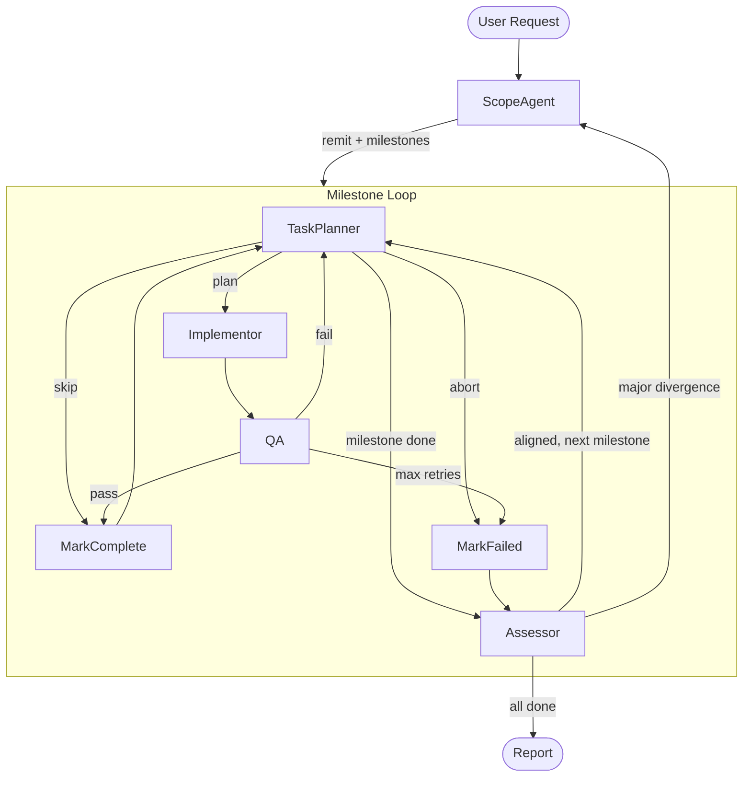
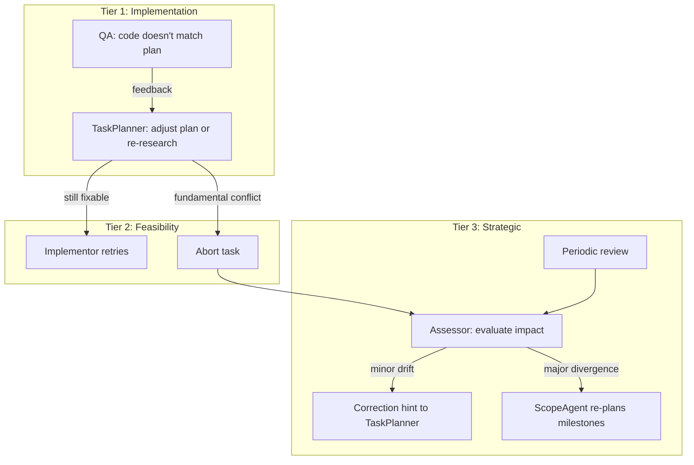

# Workflow Architecture

This document describes the multi-agent workflow for autonomous code development. The system uses a sliding window task planning model within milestone-scoped phases, with agents that self-scale through subagent delegation.

For design reasoning and alternatives considered, see [docs/DESIGN_RATIONALE.md](docs/DESIGN_RATIONALE.md).
For future optimisations and roadmap, see [docs/FUTURE_CONSIDERATIONS.md](docs/FUTURE_CONSIDERATIONS.md).

---

## Design Principles

1. **Limited Lookahead**: The further ahead you plan, the less accurate the plan. Agents think a few steps forward, execute a bite-sized chunk, then reassess. No upfront task decomposition for entire milestones.

2. **Research-Informed Planning**: Tasks are never created speculatively. The TaskPlanner researches the codebase before defining work, ensuring tasks are grounded in reality from birth.

3. **Self-Scaling via Subagents**: Agents use the LangChain subagent-as-tool pattern. Simple tasks are handled directly; complex tasks trigger subagent delegation. The LLM decides when to scale up.

4. **Milestone-Scoped Focus**: Milestones are self-contained user outcomes that constrain the TaskPlanner's thinking to a manageable scope. The TaskPlanner never needs to consider the full project -- just the current milestone.

5. **Three-Tier Escalation**: Problems are handled at the lowest level that can resolve them. QA catches implementation issues, TaskPlanner catches planning issues, and the Assessor catches strategic misalignment.

6. **Periodic Assessment**: Alignment checks happen at intervals (not after every task) to avoid premature judgment on short-term direction versus long-term progress.

7. **Context Compression**: With ~32-64k token limits, all handoffs use compressed summaries. Detailed context exists only within a single agent invocation.

---

## System Overview

Five core components, down from 11 in the previous architecture:



| Agent | Role | Scales via |
|-------|------|-----------|
| **ScopeAgent** | Define what (remit + milestones) | `explain_code`, `ask`, `web_search` subagents |
| **TaskPlanner** | Define how + plan (iterative, per task) | `explain_code`, `ask` subagents; sliding window |
| **Implementor** | Execute to spec | File tools, middleware |
| **QA** | Validate implementation | Deterministic checks + LLM assessment |
| **Assessor** | Periodic alignment check + milestone gating | Lightweight LLM judgment |

---

## The Two Loops

### Outer Loop: Scope and Milestones

The ScopeAgent runs once at the start (and again if the Assessor detects major divergence). It answers two questions:

1. **What are we trying to achieve?** → The remit (scope boundary)
2. **How will we get there at a high level?** → Milestones (user-testable outcomes)

Milestones are NOT implementation steps ("set up data models"). They ARE user outcomes ("user can create and name colonies"). They must be:
- Definable from gap analysis alone, without implementation knowledge
- Self-contained enough that the TaskPlanner can think within one milestone
- Testable: "what can the user DO after this milestone?"
- Sequential: each milestone builds on the previous

The ScopeAgent also produces a rough "areas of work" sketch per milestone (not tasks, just themes like "data models", "state integration") to give the TaskPlanner initial orientation.

### Inner Loop: Sliding Window Task Planning

Within each milestone, the TaskPlanner operates with a sliding window:

```
Round 1:
  Done: (nothing)
  Carry-forward: (nothing)
  → Think ahead: [A, B, C, D, E]
  → Execute: [A, B]

Round 2:
  Done: [A, B]
  Carry-forward: [C, D, E]
  → Refine carry-forward, think ahead: [C*, D, E, F]
  → Execute: [C*, D]

Round 3:
  Done: [A, B, C, D]
  Carry-forward: [E, F]
  → Think ahead: [E, F]
  → Execute: [E, F]

Round 4:
  Done: [A, B, C, D, E, F]
  Carry-forward: (empty)
  → "Milestone complete"
```

Key properties:
- **Constant token pressure**: Each round sees only the done summaries + a handful of carry-forward descriptions + research for the current task. A 5-task milestone and a 50-task milestone use roughly the same context per round.
- **Self-correcting**: Each round has fresh research context. If executing task A reveals task C was wrong, round 2 naturally drops or rewrites C.
- **No speculative detail**: Carry-forward tasks are rough descriptions (~100 chars). Detailed planning (PRP) only happens for the task being executed NOW.
- **Adaptive granularity**: The TaskPlanner decides what constitutes a "task". Tightly coupled changes (e.g., create data model + register in type system) become one task with a multi-file PRP.

#### TaskPlanner Inputs Per Round

| Input | Format | Purpose |
|---|---|---|
| Milestone description | ~200 chars | Constrains scope |
| Done list | task_id + description + result_summary, ~300 chars each | Firm ground truth |
| Carry-forward tasks | description + rough outcome, ~100 chars each | Orientation, not commitment |
| Last QA feedback | ~500 chars (if retry) | What went wrong |
| Correction hint | ~200 chars (if Assessor flagged drift) | Directional nudge |

#### Done List Management

For large milestones (30+ tasks), the done list could grow unbounded. Mitigation:
- Keep the last 5-7 tasks in full detail
- Summarise earlier tasks into a paragraph ("established data models for Colony, Building, Resource; integrated with GameState signal system")
- This mirrors the SummarizationMiddleware pattern used by the Implementor

---

## Agent Descriptions

### 1. ScopeAgent

**Purpose**: Understand the user's request and define milestones as user-testable outcomes.

Consolidates the previous Intent Agent, Gap Analysis Agent, and Milestone Agent into one agent that uses subagent tools to research the codebase.

| Input | Description |
|-------|-------------|
| `user_request` | Raw user input |
| `repo_root` | Repository root path |
| `prior_work` | (on re-plan) Done list summaries from prior execution |
| `divergence_analysis` | (on re-plan) Assessor's divergence report |

| Output | Description |
|--------|-------------|
| `remit` | Interpreted scope -- what the user really wants (max 1000 chars) |
| `milestones` | Ordered list of milestones (user outcomes, max 200 chars each) |
| `milestone_sketches` | Per milestone: rough areas of work (themes, not tasks) |

**Subagent tools**:
- `explain_code(query)`: Deep codebase research -- finds relevant code, explains what it does, how it works, what it connects to. Returns detailed response with key files, classes, functions.
- `ask(query)`: Targeted factual question about the codebase. Returns short, specific answer.
- `web_search(query)`: Search the internet for external information (API docs, library patterns, etc.)

**Behaviour**:
1. Interpret user request for explicit and implied needs
2. Use `explain_code` and `ask` to understand current codebase state
3. Identify gaps between current state and desired outcomes
4. Define milestones as user-testable outcomes that collectively satisfy the remit
5. Produce rough area sketches per milestone (orientation, not task lists)

**On re-plan** (Assessor escalation):
- Receives what has been accomplished and where divergence was detected
- May revise the remit (if original assumptions were wrong)
- May revise remaining milestones (keeping completed work)
- Resets the task loop's carry-forward (as if starting a new scope)

---

### 2. TaskPlanner

**Purpose**: Iteratively research, decompose, and plan tasks within a milestone scope using the sliding window model.

Consolidates the previous Researcher, Planner, Expander, and Prioritizer into one agent that self-scales via subagents.

| Input | Description |
|-------|-------------|
| `milestone` | Current milestone description + sketch |
| `done_list` | Completed task summaries (compressed) |
| `carry_forward` | Rough task descriptions from previous round |
| `last_qa_feedback` | (on retry) What went wrong |
| `correction_hint` | (from Assessor) Directional guidance |

| Output | Description |
|--------|-------------|
| `action` | `"implement"`, `"skip"`, `"abort"`, or `"milestone_done"` |
| `implementation_plan` | PRP markdown (when action is "implement") |
| `carry_forward` | Updated lookahead task descriptions for next round |
| `escalation_context` | (when action is "abort") Why this task/milestone is unfeasible |

**Subagent tools**:
- `explain_code(query)`: Research codebase to understand current state for planning decisions
- `ask(query)`: Quick factual lookups about the codebase
- Direct tools: `rag_search`, `search_files`, `find_files_by_name`, `read_file_lines`

**Three possible actions** (drive graph routing):
- `implement`: Plan is ready, route to Implementor
- `skip`: No work needed (gap already closed), route to mark_complete
- `abort`: Fundamental conflict discovered, route to mark_failed with escalation context
- `milestone_done`: All work for this milestone is complete, route to Assessor

**Behaviour per round**:
1. Review milestone scope, done list, and carry-forward
2. Research if needed (via `explain_code` or direct tools)
3. Update carry-forward: refine, add, or remove items based on current understanding
4. Pick the next bite-sized chunk from the carry-forward
5. Produce detailed PRP for the selected task(s), or signal skip/abort/done

**Retry behaviour** (when receiving QA feedback):
- Reads QA feedback and failure context
- Decides internally whether to re-research, adjust plan, or escalate
- All retry decisions are made by the TaskPlanner, not by the graph routing

**Scaling behaviour**:
- Simple task: Does a quick `rag_search`, writes plan directly. One LLM invocation.
- Complex task: Calls `explain_code` subagent for thorough research, then plans. Multiple LLM invocations.
- Retry: Reads feedback, adjusts plan or re-researches. Adapts to failure type.

---

### 3. Implementor

**Purpose**: Execute the implementation plan by making actual file changes.

Unchanged from previous architecture. Receives a detailed PRP, uses file tools to implement it.

| Input | Description |
|-------|-------------|
| `current_implementation_plan` | Full PRP from TaskPlanner |
| `repo_root` | Working directory |

| Output | Description |
|--------|-------------|
| `current_implementation_result` | Files modified, result summary, issues noticed, success flag |

**Tools**: `read_file`, `read_file_lines`, `write_file`, `create_file`, `apply_edit`

**Middleware**: `TodoListMiddleware`, `FilesystemFileSearchMiddleware`, `SummarizationMiddleware`

**Key rule**: Must use tools to make changes. Text descriptions are not sufficient.

---

### 4. QA

**Purpose**: Verify implementation satisfies the task specification.

Absorbs the previous Validator agent's deterministic file checks as a pre-step.

| Input | Description |
|-------|-------------|
| `current_implementation_result` | From Implementor |
| `current_implementation_plan` | What was planned |
| `repo_root` | Working directory |

| Output | Description |
|--------|-------------|
| `passed` | Boolean |
| `feedback` | Detailed assessment (max 500 chars) |
| `issues` | Specific problems found |

**Behaviour**:
1. **Deterministic pre-step** (no LLM): Verify all reported files exist, are non-empty, and are readable. If files are missing, fail immediately.
2. **LLM assessment**: Read actual file contents, compare against task spec, determine if requirements are functionally met.
3. Return pass/fail with detailed feedback.

All failures route to TaskPlanner (single retry path). The feedback provides enough context for the TaskPlanner to decide what to redo.

---

### 5. Assessor

**Purpose**: Periodic alignment check between execution progress and high-level intent.

| Input | Description |
|-------|-------------|
| `remit` | Scope boundary |
| `milestone` | Current milestone description |
| `done_list` | Completed task summaries |
| `carry_forward` | Current lookahead tasks |

| Output | Description |
|--------|-------------|
| `verdict` | `"aligned"`, `"minor_drift"`, `"major_divergence"`, `"milestone_complete"` |
| `correction_hint` | (minor drift) Directional guidance for TaskPlanner |
| `divergence_analysis` | (major divergence) What went wrong and why, for ScopeAgent |

**When it runs** (not after every task):
- **Periodic**: Every N completed tasks (default N=5)
- **On completion claim**: When TaskPlanner declares `milestone_done`
- **On abort**: When TaskPlanner aborts a task

**Verdicts**:
- **aligned**: Progress is on track. Continue task loop.
- **minor_drift**: Work is reasonable but drifting from milestone intent. Provides a correction hint to TaskPlanner. Carry-forward is cleared so TaskPlanner re-thinks its lookahead.
- **major_divergence**: Work contradicts remit or milestones are invalidated by what we've learned. Escalates to ScopeAgent for re-planning.
- **milestone_complete**: Milestone's user outcome is achieved. Advance to next milestone or complete workflow.

---

## The Subagent Tool Model

Agents don't call other agents directly. Instead, subagents are wrapped as LangChain tools using the `@tool` decorator. The parent agent's LLM decides when to invoke them.

### Shared Subagent Tools

| Tool | Purpose | Response Style |
|------|---------|----------------|
| `explain_code(query)` | Find and explain code relevant to the query. How it works, what connects to it, key files/classes/functions. | Detailed, structural |
| `ask(query)` | Answer a specific factual question about the codebase or project. | Short, targeted |
| `web_search(query)` | Search the internet for external information. | Summarised results |

`explain_code` and `ask` are subagents with their own tool-calling loops -- they use RAG, file search, grep, and file reading tools internally. `web_search` is a direct tool.

### Why Subagents Over Separate Graph Nodes

Previous architecture: Researcher and Planner were separate graph nodes with a fixed pipeline (always research, then plan). This created a minimum complexity floor.

New architecture: TaskPlanner has `explain_code` as a tool. For a simple task, it plans directly without calling it. For a complex task, it calls `explain_code` to research first. The LLM makes the scaling decision.

This means:
- Simple task: 1 LLM call (TaskPlanner plans directly)
- Complex task: 1 subagent call (explain_code) + 1 LLM call (TaskPlanner plans)
- No-gap task: 1 LLM call (TaskPlanner determines skip)

See [docs/DESIGN_RATIONALE.md](docs/DESIGN_RATIONALE.md) for the full reasoning on this choice.

---

## Three-Tier Failure Escalation

Problems are handled at the lowest level that can resolve them, and only bubble up when they exceed that level's authority.



| Tier | Trigger | Frequency | Scope | Handler |
|------|---------|-----------|-------|---------|
| 1. Implementation | QA failure | Every task that fails | "Code doesn't match plan" | TaskPlanner re-plans |
| 2. Feasibility | TaskPlanner abort | Rare | "This task is impossible" | Assessor evaluates |
| 3. Strategic | Periodic review or divergence | Every ~5 tasks | "We're going the wrong direction" | ScopeAgent re-plans |

---

## Periodic Assessment Model

### Why Not Per-Task Assessment

The previous architecture ran the Assessor after every single task. With the sliding window model, this creates problems:

1. **Premature judgment**: After task 1 of a 10-task milestone, the Assessor sees "we created a data model" against a milestone of "user can manage colonies" -- of course it doesn't look aligned yet.
2. **Wasted tokens**: An LLM call after every task just to say "keep going" is overhead for the ~80% of iterations where everything is fine.
3. **Misdiagnosis risk**: Short-term direction is a poor proxy for long-term progress. You'll have a much better assessment 5 iterations in rather than 1 or 2.

### Assessment Triggers

**Periodic review**: Every N completed tasks (default N=5). Simple counter in state (`tasks_since_last_review`).

**Completion claim**: TaskPlanner declares `milestone_done`. Always triggers assessment regardless of counter.

**Task abort**: TaskPlanner aborts a task with escalation context. Triggers immediate assessment.

### Assessment Question

The Assessor asks one focused question: **"Given what we've done, are we making progress toward this milestone in a way consistent with the remit?"**

Its inputs are deliberately compressed (total ~3-5k tokens):
- Remit (~200 chars)
- Current milestone description (~200 chars)
- Done list summaries (~300 chars each, 5-10 items since last review)
- Carry-forward descriptions (~100 chars each, 3-5 items)

---

## Graph Topology

### LangGraph Nodes

```python
# Core agents
workflow.add_node("scope_agent", scope_agent_node)
workflow.add_node("task_planner", task_planner_node)
workflow.add_node("implementor", implementor_node)
workflow.add_node("qa", qa_node)
workflow.add_node("assessor", assessor_node)

# State management
workflow.add_node("mark_complete", mark_complete_node)
workflow.add_node("mark_failed", mark_failed_node)
workflow.add_node("increment_attempt", increment_attempt_node)
workflow.add_node("report", report_node)
```

### Edges

```python
# Entry
workflow.set_entry_point("scope_agent")

# ScopeAgent -> TaskPlanner (start first milestone)
workflow.add_conditional_edges("scope_agent", after_scope_agent, {
    "task_planner": "task_planner",
    "end": "report",
})

# TaskPlanner routing
workflow.add_conditional_edges("task_planner", after_task_planner, {
    "implementor": "implementor",
    "mark_complete": "mark_complete",
    "mark_failed": "mark_failed",
    "assessor": "assessor",  # milestone_done
})

# Implementor -> QA (direct)
workflow.add_edge("implementor", "qa")

# QA routing
workflow.add_conditional_edges("qa", after_qa, {
    "mark_complete": "mark_complete",
    "increment_attempt": "increment_attempt",
    "mark_failed": "mark_failed",
})

# Task completion -> TaskPlanner (next round) or Assessor (periodic review)
workflow.add_conditional_edges("mark_complete", after_mark_complete, {
    "task_planner": "task_planner",
    "assessor": "assessor",  # periodic review trigger
})

# Task failure -> Assessor (evaluate impact)
workflow.add_edge("mark_failed", "assessor")

# Retry -> TaskPlanner
workflow.add_edge("increment_attempt", "task_planner")

# Assessor routing
workflow.add_conditional_edges("assessor", after_assessor, {
    "task_planner": "task_planner",      # aligned or minor_drift
    "scope_agent": "scope_agent",        # major_divergence
    "end": "report",                     # all done
})

# Report -> END
workflow.add_edge("report", END)
```

### Routing Functions

**`after_task_planner`**: Reads `task_planner_action` from state.
- `"implement"` → `"implementor"`
- `"skip"` → `"mark_complete"`
- `"abort"` → `"mark_failed"`
- `"milestone_done"` → `"assessor"`

**`after_qa`**: Reads QA result.
- `passed` → `"mark_complete"`
- `not passed, attempts < max` → `"increment_attempt"`
- `not passed, attempts >= max` → `"mark_failed"`

**`after_mark_complete`**: Checks periodic review counter.
- `tasks_since_last_review >= review_interval` → `"assessor"`
- otherwise → `"task_planner"`

**`after_assessor`**: Reads assessment verdict.
- `"aligned"` or `"minor_drift"` → `"task_planner"` (with correction hint if drift)
- `"milestone_complete"`, next milestone exists → `"task_planner"` (advance milestone)
- `"milestone_complete"`, all milestones done → `"end"`
- `"major_divergence"` → `"scope_agent"`

---

## State Schema

### WorkflowState

```python
class WorkflowState(TypedDict, total=False):
    # Configuration
    verbose: bool
    max_task_retries: int
    review_interval: int          # Periodic assessment interval (default 5)

    # Immutable inputs
    user_request: str
    repo_root: str

    # Scope (from ScopeAgent)
    remit: str
    milestones: list[dict]        # Ordered milestone descriptions + sketches
    active_milestone_index: int

    # Sliding window (managed by TaskPlanner)
    done_list: list[dict]         # Completed task summaries
    carry_forward: list[str]      # Rough task descriptions for next round

    # Current task (ephemeral, cleared between tasks)
    current_task_description: str | None
    current_implementation_plan: str | None
    current_implementation_result: dict | None
    current_qa_result: dict | None

    # TaskPlanner action (drives routing)
    task_planner_action: str | None   # "implement", "skip", "abort", "milestone_done"
    escalation_context: str | None    # Why abort, for Assessor/ScopeAgent

    # Assessment
    tasks_since_last_review: int
    last_assessment: dict | None      # Assessor verdict + details
    correction_hint: str | None       # From Assessor minor_drift

    # Retry tracking (per current task)
    attempt_count: int
    max_attempts: int

    # Workflow status
    status: str                       # "running", "complete", "failed"
    error: str | None
    work_report: str | None

    # Dashboard state
    dashboard_mode: bool
    current_node: str | None
    messages: Annotated[list[str], reducer_append]
```

### Key Differences from Previous Schema

- **Removed**: `tasks` dict (full task tree with DAG), `milestones` as dict with status tracking, `current_gap_analysis`, `current_validation_result`, `need_gaps`, `explicit_needs`, `implied_needs`, iteration tracking, multiple task ID lists
- **Added**: `done_list` (compressed), `carry_forward` (lightweight), `review_interval`, `task_planner_action`, `correction_hint`
- **Simplified**: Milestones are a simple ordered list, not a managed dict. No task dependency graph -- the TaskPlanner manages sequencing internally.

---

## Token Management

### Token Budget (~32-64k limit)

| Agent | Max Input Context | Strategy |
|-------|-------------------|----------|
| ScopeAgent | 15k | User request + subagent results |
| TaskPlanner | 12k | Milestone + done summaries + carry-forward + research |
| Implementor | 15k | Full PRP + summarisation middleware (trigger: 30k) |
| QA | 10k | Plan summary + file contents (50 lines x 10 files) |
| Assessor | 5k | Remit + milestone + done summaries + carry-forward |

### Compression Points

1. **Done list entries**: ~300 chars each (task description + result summary)
2. **Carry-forward tasks**: ~100 chars each (description + rough outcome)
3. **Implementation plan summary**: Stored in done list entry after completion
4. **QA feedback**: Max 500 chars
5. **Done list rollup**: After ~7 detailed entries, older entries summarised into a paragraph

---

## Prompt Architecture

### System Prompt Structure

All agents follow a consistent structure:

```
## ROLE
Clear identity statement

## PRIMARY OBJECTIVE
Single sentence -- what this agent produces

## PROCESS
3-5 steps

## TOOLS AVAILABLE
Tool descriptions and when to use them

## OUTPUT FORMAT
Structured output schema

## CONSTRAINTS
Clear boundaries and rules
```

### Context Message Separation

Agents receive structured message sequences, not monolithic prompts:

```python
messages = [
    # 1. Project context (static, if available)
    HumanMessage(content=f"## PROJECT CONTEXT\n{project_context}"),
    # 2. Milestone scope (from state)
    HumanMessage(content=f"## CURRENT MILESTONE\n{milestone_info}"),
    # 3. Progress (from state)
    HumanMessage(content=f"## COMPLETED WORK\n{done_list}"),
    # 4. Task-specific input (dynamic)
    HumanMessage(content=f"## INSTRUCTIONS\n{task_specific}"),
]
```

### LLM Configuration

The system uses TabbyAPI with ExLlamaV2 backend:
- **Context Window**: ~32-64k tokens (model dependent)
- **Max Tokens**: 16,384 per response

**LLM Instances**:
- `planning_llm`: For ScopeAgent, TaskPlanner, Assessor
- `coding_llm`: For Implementor
- `default_llm`: General purpose

---

## Utilities

### Normaliser Pattern (Output Repair)

Agents don't always follow output schemas perfectly. The Normaliser attempts to repair outputs:
- JSON extraction (strip markdown, find object boundaries)
- Field truncation (LLM-based compression if too long)
- Type coercion (strings to lists, numbers, etc.)
- Default population for missing optional fields

### RAG (Retrieval-Augmented Generation)

Used by subagent tools (`explain_code`, `ask`) and directly by agents:
- **Indexer**: Indexes codebase files for semantic search
- **Retriever**: Performs semantic search with configurable result count

---

## Example Workflow Trace

```
User: "Add colony management to the game"

=== SCOPE AGENT ===

[explain_code] "What game entity systems exist currently?"
  → Found: GameState.gd manages ants, resources; Entity base class exists
[ask] "Does any colony-related code exist?"
  → No colony code found

Remit: "Add colony management: data models, state integration, UI"
Milestones:
  1. "User can create colonies with properties" (sketch: data models, state hooks)
  2. "User can interact with colonies via UI" (sketch: UI components, input handling)
  3. "Colony state persists across game sessions" (sketch: save/load integration)

=== MILESTONE 1: "User can create colonies with properties" ===

--- TaskPlanner Round 1 ---
Done: (nothing)
Carry-forward: (nothing)
[explain_code] "How does the Entity base class work? How does GameState track entities?"
  → Entity.gd: base class with id, position; GameState: manages via dictionaries
Think ahead: [Colony data model, Register in GameState, Colony properties, Colony creation API]
Execute: Colony data model + Register in GameState (cohesive unit)
→ PRP: Create Colony.gd extending Entity, add colonies dict to GameState

--- Implementor ---
Created: Colony.gd, modified: GameState.gd
Result: Colony class with id, name, buildings; GameState.colonies dictionary

--- QA ---
Passed: Colony data model exists and is registered in GameState

--- TaskPlanner Round 2 ---
Done: [Colony data model + GameState registration]
Carry-forward: [Colony properties, Colony creation API]
[ask] "What properties does the user request mention for colonies?"
Think ahead: [Colony properties (resources, buildings), Creation API, Building assignment]
Execute: Colony properties + Creation API

... continues until milestone complete ...

--- TaskPlanner Round N ---
Done: [Colony model, registration, properties, creation API, building assignment]
Carry-forward: (empty)
→ "milestone_done"

--- Assessor ---
Verdict: milestone_complete
→ Advance to milestone 2

=== MILESTONE 2: "User can interact with colonies via UI" ===
... continues with fresh sliding window ...
```

---

## File Structure (Planned)

```
src/agents/
├── graph.py                    # LangGraph workflow definition
├── task_states.py              # WorkflowState and data models
├── normaliser.py               # Output repair utilities
├── llm.py                      # LLM configuration
├── agents/
│   ├── scope_agent.py          # ScopeAgent (remit + milestones)
│   ├── task_planner.py         # TaskPlanner (sliding window + PRP)
│   ├── implementor.py          # Implementor (file changes)
│   ├── qa.py                   # QA (validation + assessment)
│   ├── assessor.py             # Assessor (periodic alignment)
│   └── report.py               # Report (final summary)
├── subagents/
│   ├── explain_code.py         # explain_code subagent tool
│   ├── ask.py                  # ask subagent tool
│   └── web_search.py           # web_search tool
├── tools/
│   ├── read.py                 # File reading tools
│   ├── edit.py                 # File editing tools
│   ├── search.py               # Search tools (grep, glob, etc.)
│   └── rag.py                  # RAG search tool
└── rag/
    ├── retriever.py            # RAG retrieval
    └── indexer.py              # RAG indexing
```
