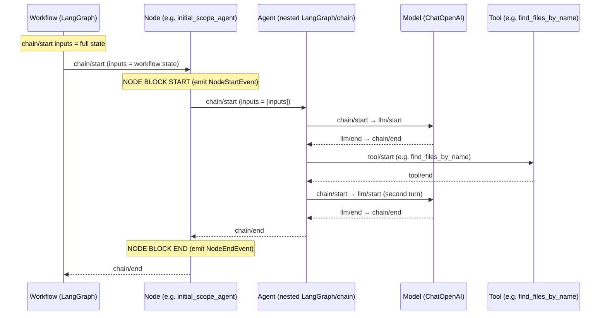

# LangChain / LangGraph callback event chain

This document describes how LangChain’s callback events (chain, LLM, tool) map to our workflow and why we filter to a single “node start/end” per workflow step.

For the workflow architecture, see [WORKFLOW_ARCHITECTURE.md](../WORKFLOW_ARCHITECTURE.md). For the code that emits node events, see [src/agents/stream/node_events.py](../src/agents/stream/node_events.py).

---

## Event types (callback layer)

LangChain’s `BaseCallbackHandler` receives these event kinds:

| Event          | When it fires | What it represents |
|----------------|---------------|--------------------|
| **chain/start** | A chain begins | Any runnable (LangGraph, LCEL chain, model wrapper) is invoked. |
| **chain/end**   | A chain finishes | That runnable completed (success). |
| **chain/error** | A chain fails   | That runnable raised. |
| **llm/start**   | LLM call begins | The underlying LLM (e.g. ChatOpenAI) is invoked. |
| **llm/end**     | LLM call ends   | The LLM returned a response. |
| **tool/start**  | Tool run begins | A tool (e.g. `find_files_by_name`, `ask`) is invoked. |
| **tool/end**    | Tool run ends   | The tool returned. |

Runs form a **tree**: each run has a `run_id` and optional `parent_run_id`. The tracer path (e.g. `[chain:LangGraph > chain:initial_scope_agent > chain:LangGraph > chain:model > llm:ChatOpenAI]`) is the chain of run types from root to that run.

---

## Run hierarchy for one workflow node

A single **workflow node** (e.g. `initial_scope_agent`) is implemented as a chain that may invoke an inner graph, which in turn invokes the model and tools. So one “node” produces multiple **chain** and **llm** runs.

Conceptually:

1. **Root graph** runs (`chain:LangGraph`) — inputs = full workflow state.
2. **Workflow node** runs (e.g. `chain:LangGraph > chain:initial_scope_agent`) — same inputs = full state; this is the run we treat as “the node block.”
3. **Nested chain runs** inside the node (e.g. inner LangGraph, `chain:model`) — inputs are *not* the workflow state (often shown as `[inputs]` in logs; they’re prompts, messages, etc.).
4. **LLM runs** — one per actual LLM call; inside an agent tool loop there are **multiple** llm/start–end pairs per node.
5. **Tool runs** — one per tool call (e.g. `find_files_by_name`, or a subagent like `ask`).

So:

- **One workflow node** ⇒ one “node start” and one “node end” that we want for the console.
- **Many chain/start–end** and **llm/start–end** (and tool/start–end) events can occur *inside* that node.

---

## Sequence diagram (one node, with agent tool loop)

Below is a simplified sequence for a single workflow node that runs an agent with tools (e.g. scope agent using the `ask` subagent). Time flows downward; indentation shows parent/child runs.

- The **first** `chain/start` that has **inputs = workflow state** and `metadata["langgraph_node"]` set is the one we use for “node started.”
- All subsequent chain/start and llm/start/end (and tool/start/end) inside that run are **inside** the node (agent loop, model calls, tools). We do *not* emit another node start for those.

---

## Why we filter: “inputs look like workflow state”

Multiple chain runs can have `metadata["langgraph_node"]` set (e.g. the same node name can appear on the node run and sometimes on inner runs). So we need an extra condition so we emit **only one** start per workflow node.

**Rule we use:** treat a run as the **workflow-node** run (and thus emit `NodeStartEvent`) only when:

1. `metadata.get("langgraph_node")` is set, and  
2. `inputs` looks like workflow state: e.g. contains both `"user_request"` and `"repo_root"` (or other `WorkflowState` keys).

The run that receives the **full state dict** as `inputs` is the actual invocation of the node. Nested runs (inner graph, model, tools) have different `inputs` (messages, prompts, tool args) and are excluded, so we get exactly one start (and one end) per workflow node.

---

## Summary

| Level        | Event        | Count per workflow node | Use in our UI |
|-------------|--------------|--------------------------|----------------|
| Workflow node | chain/start (with state inputs) | 1 | **Node start** (NodeStartEvent) |
| Workflow node | chain/end (matching run_id)     | 1 | **Node end** (NodeEndEvent) |
| Nested chain  | chain/start, chain/end          | Many | Not surfaced as node lifecycle |
| LLM           | llm/start, llm/end             | Many (agent tool loop) | Not used for node start/end |
| Tool          | tool/start, tool/end           | Many | Can be used for tool-specific UI (e.g. tool_events) |

The event chain is a tree of runs; we filter to the single run that represents the workflow node (state in, one per step) and emit node start/end only for that run.
