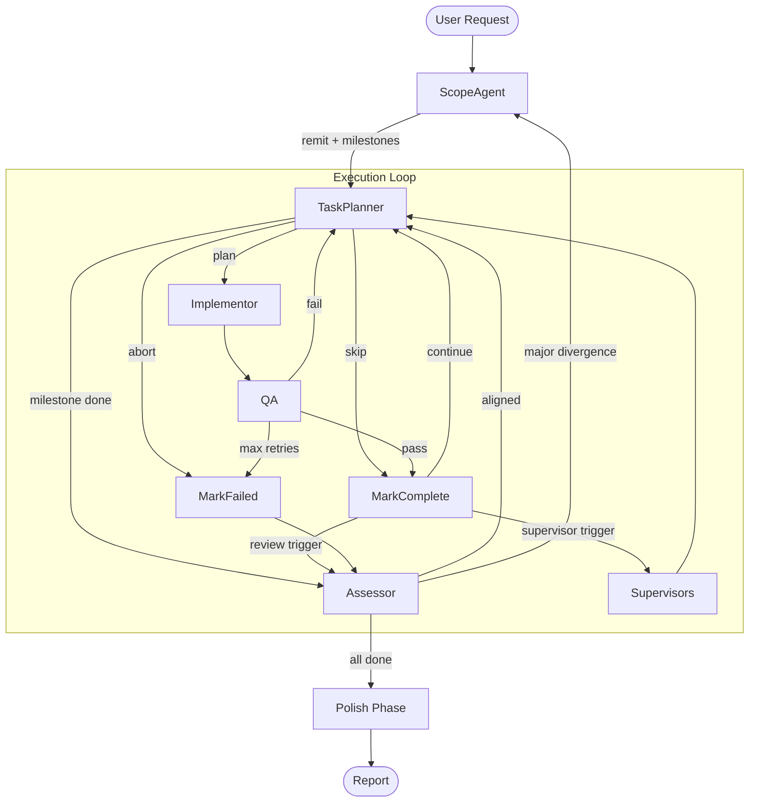

# Phase 1: Supervisor Layer Design

This document details the Phase 1 implementation of the supervisor layer described in [LEMMINGS.md](LEMMINGS.md). Phase 1 runs everything in a single LangGraph instance with supervisors as in-graph nodes using cloud LLMs while the execution loop stays on local GPU.

For the high-level vision and scale phases, see [LEMMINGS.md](LEMMINGS.md).
For the existing execution loop architecture, see [../WORKFLOW_ARCHITECTURE.md](../WORKFLOW_ARCHITECTURE.md).
For multi-model infrastructure, see [MULTI_MODEL_PLAN.md](MULTI_MODEL_PLAN.md).

---

## Overview

Phase 1 adds four things to the existing execution loop:

1. **Supervisor agents** running as in-graph nodes, triggered at natural breakpoints
2. **A signalling mechanism** for bidirectional communication between supervisors and the execution loop
3. **A repo-level knowledge store** that supervisors write to and the execution loop reads from
4. **Hybrid model routing** so supervisors run on cloud LLMs without blocking the local GPU

The execution loop continues to work exactly as designed. Supervisors wrap around it, running at defined trigger points, and their outputs feed back into the loop through both direct signals (state) and indirect influence (knowledge store).

---

## Supervisor Agents

### Execution Model

Supervisors run as graph nodes at natural breakpoints in the execution loop. They are not background processes -- they execute synchronously at trigger points, then the execution loop resumes. This is intentionally simple.

The key insight is that supervisors call cloud LLMs (via OpenRouter), so they do not compete with the local GPU that the execution loop uses. The execution loop pauses briefly while the supervisor runs on cloud, then resumes with fresh guidance. This pause is acceptable because:

- Supervisors trigger infrequently (every N tasks, on specific signals)
- Cloud LLM responses are fast (seconds, not minutes)
- Supervisor output is immediately available to the next TaskPlanner round
- No concurrency management needed -- standard sequential graph execution

### Trigger Points

Supervisors run at the same natural breakpoints as the existing periodic assessment. After `mark_complete`, the routing function already checks whether to route to the Assessor. This extends to optionally route through supervisors as well.

```
mark_complete
    |
    v
check_triggers
    |
    ├── supervisor triggers met? --> run_supervisors --> task_planner
    ├── assessment triggers met? --> assessor
    └── neither                  --> task_planner
```

When both supervisor and assessment triggers are met simultaneously, supervisors run first so their findings are available to the Assessor.

### Trigger Conditions

Each supervisor type has independent trigger conditions:

| Supervisor | Triggers | Rationale |
|-----------|----------|-----------|
| **Code Style** | Every N completed tasks (default 5), on milestone complete | Needs a batch of work to review, not every file change |
| **Design** | On milestone complete, on scope re-plan, on task abort | Design review matters at transition points, not mid-execution |
| **Internaliser** | Every N completed tasks (default 3), on milestone complete | Captures knowledge frequently so nothing is lost |

Triggers are tracked in state as simple counters, following the same pattern as `tasks_since_last_review`.

### Supervisor Contracts

All supervisors follow the same contract:

**Inputs** (from graph state):
- `remit` and `milestones` -- what we're trying to achieve
- `done_list` -- what's been completed
- `carry_forward` -- what's planned next
- Recent task results and QA feedback
- Current knowledge store contents (via RAG or direct reads)

**Outputs** (two channels):
1. **Directives** (direct, to state): Structured items written to `pending_directives` in graph state. The scope planner reads these explicitly and creates specific tasks.
2. **Knowledge updates** (indirect, to files): Markdown files written or updated in the knowledge store. Shapes future planning decisions through RAG context.

### Code Style Supervisor

**Purpose**: Review code conventions across recent work, find inconsistencies, establish and enforce patterns.

**Reads**: Recently modified files (from done list), existing convention docs in knowledge store, repository-wide patterns.

**Writes**:
- `knowledge/conventions/` -- new or updated convention rules
- Directives for specific cleanup tasks when inconsistencies are found

**Behaviour**:
1. Read recent task results to identify files changed
2. Read those files and compare against existing convention docs
3. If no conventions exist yet for a pattern, establish one (write to knowledge store)
4. If conventions exist but code doesn't match, create a cleanup directive
5. If conventions exist and code matches, do nothing

**Output schema**:
```
{
  "conventions_updated": ["list of convention docs written/updated"],
  "directives": [
    {
      "type": "cleanup",
      "description": "Standardise error handling in src/agents/tools/ to use pattern X",
      "files": ["file1.py", "file2.py"],
      "priority": "low"
    }
  ],
  "summary": "Brief description of findings"
}
```

### Design Supervisor

**Purpose**: Review solution design against what has been learned during execution. Refine architecture docs when experience contradicts assumptions.

**Reads**: Remit, milestones, done list, existing design docs in knowledge store, escalation context if any.

**Writes**:
- `knowledge/design/` -- updated architecture and design docs
- Directives for approach changes when design needs revision

**Behaviour**:
1. Read current design docs and compare against what has been built (done list + file changes)
2. Identify where the implemented solution diverges from the design
3. Determine if the divergence is the implementation being wrong or the design being wrong
4. If design is outdated, update knowledge store design docs
5. If approach needs changing, create a functional directive with specific direction

**Output schema**:
```
{
  "design_updates": ["list of design docs written/updated"],
  "directives": [
    {
      "type": "functional",
      "description": "Refactor Colony storage from array to dictionary to match Entity pattern",
      "rationale": "Entity system uses dict lookup; array breaks consistency and performance",
      "priority": "normal"
    }
  ],
  "summary": "Brief description of findings"
}
```

### Internaliser (Knowledge Supervisor)

**Purpose**: Capture novel discoveries and decisions from the execution loop's work and persist them in the knowledge store.

**Reads**: Recent task plans, implementation results, QA feedback, TaskPlanner reasoning (from done list entries and carry-forward changes).

**Writes**:
- `knowledge/lessons/` -- discovered patterns, what worked and didn't
- `knowledge/domain/` -- domain knowledge discovered during implementation

**Behaviour**:
1. Review recent task execution traces (plans, results, QA feedback)
2. Identify anything novel: a pattern that was discovered, a library behaviour that was unexpected, a design decision that was made implicitly
3. Summarise and write to knowledge store as structured items
4. Flag items that may warrant user review (e.g. significant architectural decisions made implicitly)

**Output schema**:
```
{
  "knowledge_items": [
    {
      "category": "lesson",
      "content": "LangGraph state reducers silently drop None values; always provide defaults",
      "source_task": "task_id",
      "confidence": "high",
      "needs_user_review": false
    }
  ],
  "summary": "Brief description of what was captured"
}
```

---

## Signalling

### Signal Flow

In Phase 1, signalling is in-process through graph state. No message queues, no network -- just state fields that supervisors write to and the execution loop reads from.

```
Execution Loop                    Supervisors
     |                                 |
     |-- task complete -----> trigger check
     |                                 |
     |                          [run if triggered]
     |                                 |
     |                          read state + knowledge
     |                                 |
     |                          write directives to state
     |                          write knowledge to files
     |                                 |
     |<-- pending_directives ----------|
     |<-- updated knowledge (via RAG) -|
     |                                 |
  TaskPlanner reads directives
  on next planning round
```

### Directives

Directives are the direct signal channel. They are structured items in graph state that the TaskPlanner reads explicitly.

```python
# In WorkflowState
pending_directives: list[dict]    # From supervisors, consumed by TaskPlanner
```

Each directive has:

| Field | Type | Description |
|-------|------|-------------|
| `type` | `"functional"` or `"cleanup"` | Determines priority position |
| `source` | str | Which supervisor created it |
| `description` | str (~200 chars) | What needs to be done |
| `rationale` | str (~200 chars) | Why it needs to be done |
| `priority` | `"critical"`, `"normal"`, `"low"` | Urgency level |
| `files` | list[str] (optional) | Specific files affected |

### Directive Consumption

The TaskPlanner already receives carry-forward tasks and builds its next round from them. Directives integrate into this:

1. **Critical directives**: Interrupt carry-forward. TaskPlanner must address these before continuing with the milestone. These are rare -- only used when a supervisor finds something that would make continued execution actively harmful.
2. **Normal functional directives**: Prepended to carry-forward. Addressed before existing planned work, but after current in-progress task completes.
3. **Low cleanup directives**: Appended to carry-forward. Addressed after feature work, or during idle time.

Consumed directives are removed from `pending_directives` and the task they generate is tracked in `done_list` like any other task.

### Escalations

Escalations from the execution loop to supervisors are implicit in Phase 1. Because supervisors share graph state, they can read:

- Task abort events (from `escalation_context`)
- QA failure patterns (from `done_list` entries with failure summaries)
- Carry-forward churn (comparing `carry_forward` across rounds)

No explicit escalation signal is needed when the supervisor has full state access. This is a Phase 1 simplification that would need explicit escalation events in Phase 2 (distributed).

### Pull-Forward Mechanism

Accumulated signals can pull forward the next supervisor run. This uses the same pattern as the existing `tasks_since_last_review`:

```python
# In WorkflowState
supervisor_urgency: float        # Accumulated urgency score, 0.0 = calm
```

| Signal | Urgency Weight | Source |
|--------|----------------|--------|
| QA failure | +0.3 | QA result |
| Task abort | +1.0 (immediate) | TaskPlanner |
| High carry-forward churn | +0.2 | TaskPlanner |
| Assessor minor drift | +0.5 | Assessor |

When `supervisor_urgency >= 1.0`, supervisors run regardless of their periodic counter. After running, urgency resets to 0.

---

## Knowledge Store

### Structure

A docs directory in the repository, organised by topic. Indexed by the existing RAG system for semantic search, with the `directives/` directory also read directly by the scope planner.

```
docs/knowledge/
├── conventions/          # Code style, patterns, naming
│   ├── error_handling.md
│   ├── file_structure.md
│   └── testing.md
├── design/               # Architecture decisions, solution designs
│   ├── architecture.md
│   └── data_model.md
├── lessons/              # What works and doesn't
│   ├── lessons.md
│   └── gotchas.md
├── domain/               # Problem domain knowledge
│   └── domain.md
└── _index.md             # Summary of what's in the store (maintained by internaliser)
```

### Document Format

Knowledge documents use a structured format optimised for LLM consumption. Not prose -- rules.

```markdown
# Error Handling Conventions

_Last updated by: code_style_supervisor, task_12_
_Status: established_

## Rules

1. All tool functions raise `ToolError` with descriptive message, never bare `Exception`
2. Agent nodes catch `ToolError` and include in result summary, never swallow silently
3. Graph-level errors propagate to status stream via `error` state field

## Examples

Good:
  raise ToolError(f"File not found: {path}")

Bad:
  raise Exception("error")
  return None  # silently swallowing

## Rationale

Consistent error handling ensures QA can diagnose failures from result summaries
without reading implementation code.
```

Key format principles:
- **Rules, not descriptions**: "Do X" rather than "We tend to do X"
- **Source tracking**: Which supervisor wrote it, after which task
- **Status field**: `established` (confirmed pattern), `provisional` (supervisor's best guess, awaiting user confirmation), `deprecated` (no longer applies)
- **Examples**: Concrete good/bad examples are more actionable than abstract rules
- **Short**: Each doc addresses one concern. 500 chars or less for the rules section.

### Knowledge Injection into Prompts

The execution loop reads knowledge through two mechanisms:

1. **RAG search**: During TaskPlanner research, `rag_search` and `explain_code` can find relevant knowledge docs alongside code. Knowledge docs are indexed by the existing RAG system.

2. **Direct injection**: The scope planner and TaskPlanner receive a `## PROJECT KNOWLEDGE` section in their prompt context, containing the most relevant knowledge docs for the current milestone. This is assembled by reading the knowledge store index and selecting docs by topic relevance.

The direct injection is what makes this work -- it ensures knowledge isn't just available but actively presented. The prompt structure (already defined in the workflow architecture) extends to:

```python
messages = [
    HumanMessage(content=f"## PROJECT CONTEXT\n{project_context}"),
    HumanMessage(content=f"## PROJECT KNOWLEDGE\n{relevant_knowledge}"),  # NEW
    HumanMessage(content=f"## CURRENT MILESTONE\n{milestone_info}"),
    HumanMessage(content=f"## ACTIVE DIRECTIVES\n{pending_directives}"),  # NEW
    HumanMessage(content=f"## COMPLETED WORK\n{done_list}"),
    HumanMessage(content=f"## INSTRUCTIONS\n{task_specific}"),
]
```

### Knowledge Relevance Selection

For direct injection, we need to select which knowledge docs are relevant to the current context. In Phase 1, this is simple:

- **Always include**: Active convention docs (small, always relevant)
- **Milestone-scoped**: Design docs that match the current milestone's area sketch themes
- **Recent lessons**: Lessons captured in the current milestone

Token budget for knowledge injection: ~2k tokens. This constrains the amount of knowledge that can be injected, which is itself a forcing function for keeping knowledge docs concise.

---

## Hybrid Model Routing

### Model Assignment

Supervisors run on cloud LLMs via OpenRouter. The execution loop stays on local GPU. This is the key enabler for Phase 1 -- supervisors don't compete for local compute.

| Component | Model Role | Backend | Rationale |
|-----------|-----------|---------|-----------|
| ScopeAgent, TaskPlanner, Implementor, QA, Assessor | `primary` | Local GPU (Qwen) | Core execution, fast iteration, no cost |
| Code Style Supervisor | `supervisor` | Cloud (OpenRouter) | Needs strong judgment, runs infrequently |
| Design Supervisor | `supervisor` | Cloud (OpenRouter) | Needs strong reasoning, runs infrequently |
| Internaliser | `supervisor` | Cloud (OpenRouter) | Needs synthesis ability, runs infrequently |
| Summarizer, Normaliser | `summarizer` | CPU (Ollama) | Low capability needed, high frequency |

This builds directly on the LLM Registry from [MULTI_MODEL_PLAN.md](MULTI_MODEL_PLAN.md). The `supervisor` role maps to cloud models:

```python
# In config
"supervisor": {
    "provider": "openrouter",
    "model": "anthropic/claude-sonnet-4-20250514",
    "base_url": "https://openrouter.ai/api/v1",
    "api_key": "${OPENROUTER_API_KEY}"
}
```

### Cost Management

Cloud calls cost money. Supervisors must be cost-conscious:

- **Infrequent triggers**: Default every 3-5 tasks, not every task
- **Compressed inputs**: Supervisors receive summarised state, not full context (~5k tokens input)
- **Bounded outputs**: Output schemas are small and structured
- **Configurable**: Supervisors can be individually enabled/disabled, trigger intervals adjusted
- **Fallback**: If OpenRouter is unavailable, supervisors are skipped (execution loop continues unaffected)

Estimated cost per supervisor run (using Claude Sonnet-class model):
- Input: ~5k tokens, Output: ~1k tokens
- Per run: ~$0.02-0.04
- Per milestone (assuming 10 tasks, 2-3 supervisor runs): ~$0.06-0.12

### Graceful Degradation

If the cloud LLM is unavailable (network down, API error, no API key configured):

1. Supervisor node catches the error
2. Logs a warning
3. Returns empty directives (no-op)
4. Execution loop continues normally

The system works without supervisors -- they improve quality but are not required for functional execution.

---

## Mitigations for Phase 1 Challenges

### LLM Sensitivity to Written Guidance

**Risk**: The execution loop's LLM ignores or under-weights knowledge store contents in its planning.

**Mitigations**:

1. **Structured format**: Knowledge docs use rules, not prose. "Do X, not Y" with concrete examples. LLMs respond better to directive language than descriptive language.

2. **Active injection, not passive availability**: Knowledge is injected as a labeled prompt section (`## PROJECT KNOWLEDGE`), not left for RAG to maybe find. This puts it directly in the LLM's attention window.

3. **Directive-to-task pipeline**: Critical guidance doesn't rely on the LLM "noticing" knowledge. It arrives as an explicit directive that the TaskPlanner is prompted to read and act on. The prompt includes: "Check ACTIVE DIRECTIVES. Each directive MUST be addressed -- create a task, explain why it's already handled, or escalate."

4. **Calibration through testing**: Run the execution loop with known knowledge docs and verify that planning decisions change accordingly. This is testable -- inject a convention doc and confirm the next implementation follows it.

### Convergence Criterion for Polish Loops

**Risk**: Supervisors continuously find improvements, creating an infinite refinement loop.

**Mitigations**:

1. **Bounded polish phase**: After the remit is functionally complete, the system enters a bounded polish phase. This phase processes only existing cleanup directives (no new supervisor runs) and is limited to N tasks (configurable, default 10). After N tasks or an empty backlog, the workflow completes.

2. **Directive aging**: Cleanup directives that have been in `pending_directives` for more than N task completions (default 15) without being picked up are automatically dropped. If they weren't important enough to pick up in 15 tasks, they're not important enough to keep.

3. **Supervisor self-assessment**: Each supervisor run compares its findings against its previous run. If the delta is small (few new issues, mostly the same patterns), it reports "converging" and its trigger interval doubles. This creates natural decay.

4. **Hard cap on cleanup directives**: Maximum 10 pending cleanup directives at any time. When a new one is added and the cap is reached, the oldest is dropped.

### Prioritisation Implementation

**Risk**: The TaskPlanner doesn't correctly weigh functional work against cleanup directives.

**Mitigations**:

1. **Explicit prompt structure**: Directives are presented to the TaskPlanner in priority order within a labeled section. The prompt instructs: "Functional directives before cleanup. Cleanup only when no functional work remains or when explicitly waiting."

2. **Separation in state**: `pending_directives` has a `type` field. The context assembly code filters and orders them before injecting into the prompt: functional first, then cleanup.

3. **Feature-first by construction**: Carry-forward tasks (from the milestone scope) are presented before cleanup directives in the prompt. The TaskPlanner sees "here's what you planned to do next" before "here's what supervisors suggest cleaning up." Natural reading order creates priority.

---

## Graph Integration

### New State Fields

```python
# Added to WorkflowState
pending_directives: list[dict]    # Supervisor directives awaiting consumption
supervisor_urgency: float         # Accumulated urgency score for pull-forward
supervisor_run_log: list[dict]    # Record of supervisor runs (type, task_count, summary)
tasks_since_last_supervisor: int  # Counter for periodic supervisor triggers
```

### New Nodes

```python
# Supervisor nodes
workflow.add_node("run_supervisors", run_supervisors_node)
```

A single `run_supervisors` node that internally dispatches to active supervisor types based on their individual trigger conditions. This keeps the graph topology simple -- one node, not three.

### Modified Routing

The `after_mark_complete` routing function extends to check supervisor triggers:

```python
def after_mark_complete(state):
    # Existing: check assessment trigger
    if state["tasks_since_last_review"] >= state["review_interval"]:
        return "assessor"

    # New: check supervisor triggers
    if should_run_supervisors(state):
        return "run_supervisors"

    return "task_planner"

# run_supervisors routes back to task_planner (or assessor if both triggered)
workflow.add_conditional_edges("run_supervisors", after_supervisors, {
    "task_planner": "task_planner",
    "assessor": "assessor",
})
```

### Updated Graph Topology



---

## Additional Gaps and Opportunities

### Cold Start

On the first run against a new repository, the knowledge store is empty. Supervisors have no conventions to compare against, no design docs to review, no lessons to reference.

The first few supervisor runs are therefore **bootstrapping runs** -- they establish baselines rather than finding deviations. The code style supervisor's first run should scan the codebase and write initial convention docs. The design supervisor's first run should capture the initial architecture. The internaliser captures initial domain knowledge.

This needs explicit handling: supervisors should be aware they're in bootstrap mode (empty knowledge store) and behave differently -- establishing rather than comparing.

### Supervisor Output Validation

Supervisors write to the knowledge store and produce directives. A supervisor that hallucinates or produces poor-quality guidance could poison future execution.

Mitigations to consider:
- **Schema validation**: Supervisor outputs must match their defined schema. Malformed outputs are discarded with a warning.
- **Provisional status**: New knowledge docs default to `provisional` status. After being successfully used by the execution loop for N tasks without issues, they upgrade to `established`.
- **User review queue**: Items flagged as `needs_user_review` are surfaced in the UI for human confirmation.

### Supervisor Scope Boundaries

The design supervisor and code style supervisor both have opinions about patterns. Without clear boundaries, they could write conflicting guidance.

Ownership rules:
- **Code style supervisor**: Owns `conventions/`. Covers naming, formatting, error handling patterns, file structure conventions.
- **Design supervisor**: Owns `design/`. Covers architecture decisions, data model choices, integration patterns, component boundaries.
- **Internaliser**: Owns `lessons/` and `domain/`. Captures facts and observations, never prescribes patterns.

A supervisor must not write to another supervisor's directories.

### Observability

Supervisor activity needs to be visible:
- **Stream layer**: Supervisor runs should emit events to the existing stream layer so the console UI can show "Code Style Supervisor: found 3 inconsistencies, created 2 cleanup directives"
- **Run log**: `supervisor_run_log` in state provides a history of what each supervisor found and did
- **Knowledge changelog**: Each knowledge doc tracks its update history (which supervisor, after which task, what changed)

### Opportunity: User Knowledge Seeding

Users could pre-populate `docs/knowledge/` with their own conventions and design docs before the first run. The system immediately benefits from this -- the execution loop has guidance from task 1, and supervisors have baselines to compare against.

This is a low-effort, high-value feature: just document the knowledge store format and let users write their own docs.

### Opportunity: Assessor-Supervisor Collaboration

The existing Assessor runs periodic alignment checks. Supervisor findings could feed directly into the Assessor's judgment. If supervisors have flagged multiple design deviations, the Assessor should weigh that as evidence of drift -- even if the done list looks on track.

In Phase 1 this is straightforward: the Assessor reads `supervisor_run_log` and `pending_directives` as additional inputs.

---

## Summary

Phase 1 is deliberately simple: supervisors are graph nodes that run on cloud LLMs at natural breakpoints, communicate through state fields and a markdown file store, and feed back into the execution loop through explicit directives and ambient knowledge.

The complexity is bounded by keeping everything in-process. Supervisors share graph state, so signalling is trivial. The knowledge store is files, so there's no database to manage. Cloud LLMs handle supervisor work, so the local GPU stays free for execution.

This proves the supervision model -- does asynchronous review and refinement actually improve output quality? -- before investing in the distributed complexity of Phase 2.
